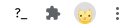
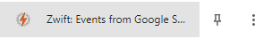
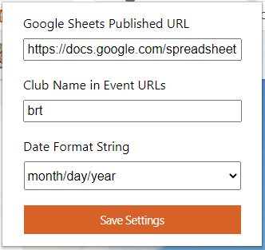

# Zwift: Publish Events from Google Sheets

This is a new variation on [Zwift: Edit Events Extension](https://github.com/jessicah/zwift-edit-events-extensions), that pulls data from a published Google Sheet document.

An example of an events document: https://docs.google.com/spreadsheets/d/1jlLrcjJK6UdQuqB72RYXUvdHK4zE6JrkLDBjCIFJ2CE/edit?usp=sharing

Important: Event date is in UTC.

Even if you don't have a link to a TSV document (you don't have to use Google Sheets), this extension can still be helpful:

- A Create Change Request button has been added to pre-fill an Event Change Request form with the data for the event
- Edits to the first category (indicated with orange border) will apply to all other categories
  - Map
  - Course
  - Duration Type
  - Duration for Laps or Distance (Time not yet supported)
  - Everything else not yet supported

If you need to make edits to the other categories, make your changes to the first category, then make your subsequent edits afterwards.

## To publish Google Sheet:

1. **File**
2. **Publish to the web**
3. Link: **Sheet1**, **Tab-separated values (.tsv)**
4. **Publish**
5. Copy the URL and save it for the install step

The **Automatically republish when changes are made** should also be checked (seems to be on by default).

## To install:

1. Download from https://github.com/jessicah/zwift-publish-events-from-sheets, click on the **Code** drop-down > **Download ZIP** and extract contents somewhere useful
4. Go to **chrome://extensions** in your address bar to open the Extensions page
5. Click the **Load unpacked** button
6. Navigate to the folder you downloaded and extracted, and **Select Folder**
7. Enjoy!

## To configure:

If the BRT icon is showing, click on it to open the options panel.

If it is not:
   1. Click on the "jigaw piece" extension icon
   2. Click on "Zwift: Events from Google Sheets";

In the opened options panel, enter value of your published Google Sheet. If you'd also like to use the automation of all events, then also add your club name.

For example, BRT's club URL is [https://www.zwift.com/clubs/**brt**](https://www.zwift.com/clubs/brt), so you
would enter **brt** for the club name.

Then hit that **Save Settings**.

## To use:

1. Navigate to [Zwift Events](https://www.zwift.com/events/)
2. Click on **Auto-upload Events**

Upon loading your club events, the extension will go through each event one-by-one, opening a tab and running the `update from sheets`
script. Once you're done, close the tab, and the next event will be opened. This will repeat until finished.

The `update from sheets` will automatically fetch your published Google Sheet, update all categories, and hit Publish! for you.

Events that don't have a matching title will be skipped over, and their title changed to italics to reflect that they haven't been processed. You
can then process these ones as per normal.

You can have as many events in the sheet as you want, and shuffle them around as needed, e.g. delete the past month to update with new data. It will iterate over all non-empty rows to find a matching entry.

Some courses, such as Bologna TT, if you want to do multiple laps, you'll need to enter a distance. This is a limitation with Zwift's event editing UI. In any case, you can always make further edits if needed.

Additionally, a new button, **Create Change Request** has been added to the bottom of the event editing page, which will open the
Event Change Request form in a new tab, and pre-fill it with the data from the event, which should help speed up that process too.